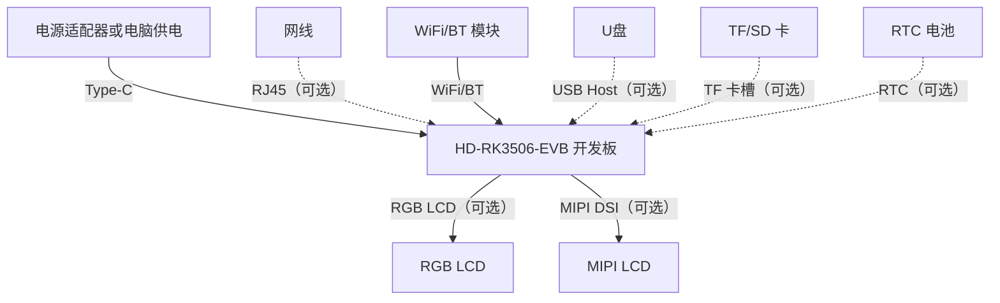

# 硬件连接

:::tip 提示

本指南针对首次使用 **HD-RK3506-EVB** 开发板的用户，详细阐述标准的接线与开机流程，确保系统能够安全、正常运行。

:::

## 1. 快速启动连接图

  用户可根据快速启动连接图进行连接。

## 2. 快速启动连接示例

### 2.1 电源供电

- 使用电源适配器或电脑USB连接Type-C 至 **HD-RK3506-EVB**，系统电源灯**红灯常亮**。

- 等待系统启动完成，当系统启动完成后，系统运行指示灯**蓝色灯闪烁**。

### 2.2 串口连接

- 使用串口模块连接开发板。
- 串口模块的 TX 接入 HD-RK3506-EVB 的 RX。
- 串口模块的 RX 接入 HD-RK3506-EVB 的 TX。
- 串口模块的 GND 接入 HD-RK3506-EVB的 GND。

  
  

​	系统启动后，将会从调试串口输出打印信息。

### 2.3 屏幕连接

- HD-RK3506-EVB 可接入 RGB LCD 或 MIPI LCD。

- 两者同时只能单独显示一个，不可同时显示。

#### MIPI LCD

  HD-RK3506-EVB 使用 32pin 同向排线连接 万象奥科适配的 7寸MIPI LCD屏幕

  
  

#### RGB LCD

  HD-RK3506-EVB 使用 40pin 同向排线连接 万象奥科适配的 5寸RGB LCD屏幕

  
  

  

  
